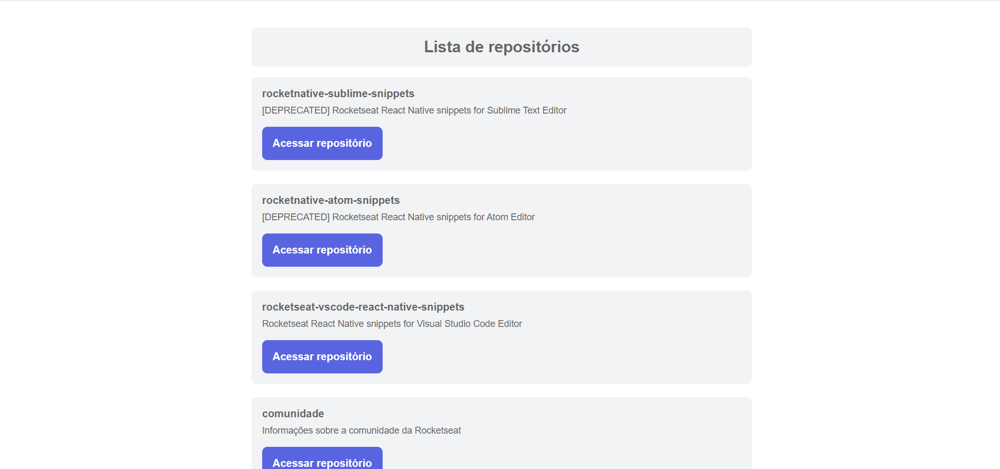

<p></p>

> 🚀 Lista de repositórios é uma aplicação que lista repositórios do Github.

<p align="center">
 <a href="#overview">Overview</a> •
 <a href="#demonstracao">Demonstração</a> •
 <a href="#comousar">Como usar</a> •
 <a href="#tecnologias">Tecnologias</a> • 
 <a href="#autora">Autor</a>
</p>

<h2 id="overview">✨ Overview</h2>

<p>
  Lista de repositórios foi desenvolvida com intuito de aplicar os conceitos estudados no capítulo 1 do Bootcamp Ignite de 
  ReactJS da Rocketseat. Nesse capítulo foram abordados os seguintes temas:</br>
  • Configuração de ambiente de projeto React do zero: Webpack e Babel.</br>
  • Fundamentos ReactJS: Hooks(useState, useEffect), Propriedades(props), imutabilidade.</br>
  • Consumo uma Web API com React.</br>
  • Typescript: Fundamentos, Typescript no React e Componentes com Typescript.</br>
  • React DevTools</br>
</p>

<h2 id="demonstracao">🖱 Demonstração</h2>

<p>
  <span></span>
</p>

<h2 id="comousar">⚒️ Como usar</h2>

<h3>Pré-requisitos</h3>

<p>
    Para iniciar o desenvolvimento é necessário primeiramente que você instale as seguintes ferramentas:
    <ul>
      <li><a href="https://nodejs.org/en/">Node.js</a></li>
      <li><a href="https://classic.yarnpkg.com/en/">Yarn</a></li>
    </ul>

    Recomendo para uma melhor experiência no desenvolvimento da aplicação Meu encurtador de Links utilizar o editor de código Visual Studio Code. 
  <a href="https://code.visualstudio.com/">VSCode</a>
</p>

<h3>Instalação</h3>
  <p>Abra o projeto no seu editor de código ou no terminal do seu computador e execute o comando abaixo.</p>

  ```sh

npm install --global yarn

```

<h3>Rodando a aplicação</h3>
  <p>No terminal execute o comando abaixo.</p>

```sh

yarn dev

```

<p>A aplicação será aberta na porta:3000. No seu navegador acesse http://localhost:3000</p>


<h2 id="tecnologias">🛸 Tecnologias</h2>
  
  <p>
    As seguintes ferramentas foram utilizadas no desenvolvimento dessa aplicação:
    <ul>
      <li><a href="https://nodejs.org/en/">Node.js</a></li>
      <li><a href="https://pt-br.reactjs.org/">React.js</a></li>
      <li><a href="https://www.typescriptlang.org/">React.js</a></li> 
    </ul>
  </p>

  <h2 id="autora">👤 Autor</h2>

<h3>Desenvolvido por Ricardo Nagel 🚀</h3>

* [Linkedin](https://www.linkedin.com/in/ricardonagel/)

  
<strong align="center">Deixe sua ⭐️ se gostou do projeto</strong>

  
